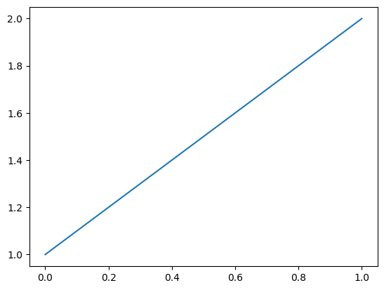

```
import matplotlib.pyplot as plt

plt.plot([1, 2])
plt.gca()
```


    

    


```
import marimo as mo

mo.md("# Welcome to marimo! 🌊🍃")
```


<span class="markdown prose dark:prose-invert"><h1 id="welcome-to-marimo">Welcome to marimo! 🌊🍃</h1></span>


```
slider = mo.ui.slider(1, 22)
```


```
mo.md(
    f"""
marimo is a **reactive** Python notebook.

This means that unlike traditional notebooks, marimo notebooks **run
automatically** when you modify them or
interact with UI elements, like this slider: {slider}.

{"##" + "🍃" * slider.value}
"""
)
```


<span class="markdown prose dark:prose-invert"><span class="paragraph">marimo is a <strong>reactive</strong> Python notebook.</span>
<span class="paragraph">This means that unlike traditional notebooks, marimo notebooks <strong>run
automatically</strong> when you modify them or
interact with UI elements, like this slider: <marimo-ui-element object-id='MJUe-0' random-id='8fdac69a-5ee1-568e-c275-e831e3655397'><marimo-slider data-initial-value='1' data-label='null' data-start='1' data-stop='22' data-steps='[]' data-debounce='false' data-disabled='false' data-orientation='&quot;horizontal&quot;' data-show-value='false' data-include-input='false' data-full-width='false'></marimo-slider></marimo-ui-element>.</span>
<h2 id="_1">🍃</h2></span>


```
mo.accordion(
    {
        "Tip: disabling automatic execution": mo.md(
            rf"""
        marimo lets you disable automatic execution: just go into the
        notebook settings and set

        "Runtime > On Cell Change" to "lazy".

        When the runtime is lazy, after running a cell, marimo marks its
        descendants as stale instead of automatically running them. The
        lazy runtime puts you in control over when cells are run, while
        still giving guarantees about the notebook state.
        """
        )
    }
)
```


<marimo-accordion data-labels='[&quot;&lt;span class=&#92;&quot;markdown prose dark:prose-invert&#92;&quot;&gt;&lt;span class=&#92;&quot;paragraph&#92;&quot;&gt;Tip: disabling automatic execution&lt;/span&gt;&lt;/span&gt;&quot;]' data-multiple='false'><div><span class="markdown prose dark:prose-invert"><span class="paragraph">marimo lets you disable automatic execution: just go into the
notebook settings and set</span>
<span class="paragraph">"Runtime &gt; On Cell Change" to "lazy".</span>
<span class="paragraph">When the runtime is lazy, after running a cell, marimo marks its
descendants as stale instead of automatically running them. The
lazy runtime puts you in control over when cells are run, while
still giving guarantees about the notebook state.</span></span></div></marimo-accordion>


```
mo.md(
    """
    Tip: This is a tutorial notebook. You can create your own notebooks
    by entering `marimo edit` at the command line.
    """
).callout()
```


<marimo-callout-output data-html='&quot;&lt;span class=&#92;&quot;markdown prose dark:prose-invert&#92;&quot;&gt;&lt;span class=&#92;&quot;paragraph&#92;&quot;&gt;Tip: This is a tutorial notebook. You can create your own notebooks&#92;nby entering &lt;code&gt;marimo edit&lt;/code&gt; at the command line.&lt;/span&gt;&lt;/span&gt;&quot;' data-kind='&quot;neutral&quot;'></marimo-callout-output>


## 1. Reactive execution

A marimo notebook is made up of small blocks of Python code called
cells.

marimo reads your cells and models the dependencies among them: whenever
a cell that defines a global variable  is run, marimo
**automatically runs** all cells that reference that variable.

Reactivity keeps your program state and outputs in sync with your code,
making for a dynamic programming environment that prevents bugs before they
happen.


```
(
    mo.md(
        f"""
        **✨ Nice!** The value of `changed` is now {changed}.

        When you updated the value of the variable `changed`, marimo
        **reacted** by running this cell automatically, because this cell
        references the global variable `changed`.

        Reactivity ensures that your notebook state is always
        consistent, which is crucial for doing good science; it's also what
        enables marimo notebooks to double as tools and  apps.
        """
    )
    if changed
    else mo.md(
        """
        **🌊 See it in action.** In the next cell, change the value of the
        variable  `changed` to `True`, then click the run button.
        """
    )
)
```


<span class="markdown prose dark:prose-invert"><span class="paragraph"><strong>🌊 See it in action.</strong> In the next cell, change the value of the
variable  <code>changed</code> to <code>True</code>, then click the run button.</span></span>


```
changed = False
```


```
mo.accordion(
    {
        "Tip: execution order": (
            """
            The order of cells on the page has no bearing on
            the order in which cells are executed: marimo knows that a cell
            reading a variable must run after the cell that  defines it. This
            frees you to organize your code in the way that makes the most
            sense for you.
            """
        )
    }
)
```


<marimo-accordion data-labels='[&quot;&lt;span class=&#92;&quot;markdown prose dark:prose-invert&#92;&quot;&gt;&lt;span class=&#92;&quot;paragraph&#92;&quot;&gt;Tip: execution order&lt;/span&gt;&lt;/span&gt;&quot;]' data-multiple='false'><div><span class="markdown prose dark:prose-invert"><span class="paragraph">The order of cells on the page has no bearing on
the order in which cells are executed: marimo knows that a cell
reading a variable must run after the cell that  defines it. This
frees you to organize your code in the way that makes the most
sense for you.</span></span></div></marimo-accordion>


**Global names must be unique.** To enable reactivity, marimo imposes a
constraint on how names appear in cells: no two cells may define the same
variable.


```
mo.accordion(
    {
        "Tip: encapsulation": (
            """
            By encapsulating logic in functions, classes, or Python modules,
            you can minimize the number of global variables in your notebook.
            """
        )
    }
)
```


<marimo-accordion data-labels='[&quot;&lt;span class=&#92;&quot;markdown prose dark:prose-invert&#92;&quot;&gt;&lt;span class=&#92;&quot;paragraph&#92;&quot;&gt;Tip: encapsulation&lt;/span&gt;&lt;/span&gt;&quot;]' data-multiple='false'><div><span class="markdown prose dark:prose-invert"><span class="paragraph">By encapsulating logic in functions, classes, or Python modules,
you can minimize the number of global variables in your notebook.</span></span></div></marimo-accordion>


```
mo.accordion(
    {
        "Tip: private variables": (
            """
            Variables prefixed with an underscore are "private" to a cell, so
            they can be defined by multiple cells.
            """
        )
    }
)
```


<marimo-accordion data-labels='[&quot;&lt;span class=&#92;&quot;markdown prose dark:prose-invert&#92;&quot;&gt;&lt;span class=&#92;&quot;paragraph&#92;&quot;&gt;Tip: private variables&lt;/span&gt;&lt;/span&gt;&quot;]' data-multiple='false'><div><span class="markdown prose dark:prose-invert"><span class="paragraph">Variables prefixed with an underscore are "private" to a cell, so
they can be defined by multiple cells.</span></span></div></marimo-accordion>


## 2. UI elements

Cells can output interactive UI elements. Interacting with a UI
element **automatically triggers notebook execution**: when
you interact with a UI element, its value is sent back to Python, and
every cell that references that element is re-run.

marimo provides a library of UI elements to choose from under
`marimo.ui`.

**🌊 Some UI elements.** Try interacting with the below elements.


```
icon = mo.ui.dropdown(["🍃", "🌊", "✨"], value="🍃")
```


```
repetitions = mo.ui.slider(1, 16, label=f"number of {icon.value}: ")
```


```
icon, repetitions
```


```
mo.md("# " + icon.value * repetitions.value)
```


<span class="markdown prose dark:prose-invert"><h1 id="_1">🍃</h1></span>


## 3. marimo is just Python

marimo cells parse Python (and only Python), and marimo notebooks are
stored as pure Python files — outputs are _not_ included. There's no
magical syntax.

The Python files generated by marimo are:

- easily versioned with git, yielding minimal diffs
- legible for both humans and machines
- formattable using your tool of choice,
- usable as Python  scripts, with UI  elements taking their default
values, and
- importable by other modules (more on that in the future).

## 4. Running notebooks as apps

marimo notebooks can double as apps. Click the app window icon in the
bottom-right to see this notebook in "app view."

Serve a notebook as an app with `marimo run` at the command-line.
Of course, you can use marimo just to level-up your
notebooking, without ever making apps.

## 5. The `marimo` command-line tool

**Creating and editing notebooks.** Use

```
marimo edit
```

in a terminal to start the marimo notebook server. From here
you can create a new notebook or edit existing ones.


**Running as apps.** Use

```
marimo run notebook.py
```

to start a webserver that serves your notebook as an app in read-only mode,
with code cells hidden.

**Convert a Jupyter notebook.** Convert a Jupyter notebook to a marimo
notebook using `marimo convert`:

```
marimo convert your_notebook.ipynb > your_app.py
```

**Tutorials.** marimo comes packaged with tutorials:

- `dataflow`: more on marimo's automatic execution
- `ui`: how to use UI elements
- `markdown`: how to write markdown, with interpolated values and
   LaTeX
- `plots`: how plotting works in marimo
- `sql`: how to use SQL
- `layout`: layout elements in marimo
- `fileformat`: how marimo's file format works
- `markdown-format`: for using `.md` files in marimo
- `for-jupyter-users`: if you are coming from Jupyter

Start a tutorial with `marimo tutorial`; for example,

```
marimo tutorial dataflow
```

In addition to tutorials, we have examples in our
[our GitHub repo](https://www.github.com/marimo-team/marimo/tree/main/examples).

## 6. The marimo editor

Here are some tips to help you get started with the marimo editor.


```
mo.accordion(tips)
```


<marimo-accordion data-labels='[&quot;&lt;span class=&#92;&quot;markdown prose dark:prose-invert&#92;&quot;&gt;&lt;span class=&#92;&quot;paragraph&#92;&quot;&gt;Saving&lt;/span&gt;&lt;/span&gt;&quot;, &quot;&lt;span class=&#92;&quot;markdown prose dark:prose-invert&#92;&quot;&gt;&lt;span class=&#92;&quot;paragraph&#92;&quot;&gt;Running&lt;/span&gt;&lt;/span&gt;&quot;, &quot;&lt;span class=&#92;&quot;markdown prose dark:prose-invert&#92;&quot;&gt;&lt;span class=&#92;&quot;paragraph&#92;&quot;&gt;Console Output&lt;/span&gt;&lt;/span&gt;&quot;, &quot;&lt;span class=&#92;&quot;markdown prose dark:prose-invert&#92;&quot;&gt;&lt;span class=&#92;&quot;paragraph&#92;&quot;&gt;Creating, Moving, and Deleting Cells&lt;/span&gt;&lt;/span&gt;&quot;, &quot;&lt;span class=&#92;&quot;markdown prose dark:prose-invert&#92;&quot;&gt;&lt;span class=&#92;&quot;paragraph&#92;&quot;&gt;Disabling Automatic Execution&lt;/span&gt;&lt;/span&gt;&quot;, &quot;&lt;span class=&#92;&quot;markdown prose dark:prose-invert&#92;&quot;&gt;&lt;span class=&#92;&quot;paragraph&#92;&quot;&gt;Disabling Cells&lt;/span&gt;&lt;/span&gt;&quot;, &quot;&lt;span class=&#92;&quot;markdown prose dark:prose-invert&#92;&quot;&gt;&lt;span class=&#92;&quot;paragraph&#92;&quot;&gt;Code Folding&lt;/span&gt;&lt;/span&gt;&quot;, &quot;&lt;span class=&#92;&quot;markdown prose dark:prose-invert&#92;&quot;&gt;&lt;span class=&#92;&quot;paragraph&#92;&quot;&gt;Code Formatting&lt;/span&gt;&lt;/span&gt;&quot;, &quot;&lt;span class=&#92;&quot;markdown prose dark:prose-invert&#92;&quot;&gt;&lt;span class=&#92;&quot;paragraph&#92;&quot;&gt;Command Palette&lt;/span&gt;&lt;/span&gt;&quot;, &quot;&lt;span class=&#92;&quot;markdown prose dark:prose-invert&#92;&quot;&gt;&lt;span class=&#92;&quot;paragraph&#92;&quot;&gt;Keyboard Shortcuts&lt;/span&gt;&lt;/span&gt;&quot;, &quot;&lt;span class=&#92;&quot;markdown prose dark:prose-invert&#92;&quot;&gt;&lt;span class=&#92;&quot;paragraph&#92;&quot;&gt;Configuration&lt;/span&gt;&lt;/span&gt;&quot;, &quot;&lt;span class=&#92;&quot;markdown prose dark:prose-invert&#92;&quot;&gt;&lt;span class=&#92;&quot;paragraph&#92;&quot;&gt;Exit &amp;amp; Shutdown&lt;/span&gt;&lt;/span&gt;&quot;]' data-multiple='false'><div><span class="markdown prose dark:prose-invert"><span class="paragraph"><strong>Saving</strong></span>
<ul>
<li>
<span class="paragraph"><em>Name</em> your app using the box at the top of the screen, or
  with <code>Ctrl/Cmd+s</code>. You can also create a named app at the
  command line, e.g., <code>marimo edit app_name.py</code>.</span>
</li>
<li>
<span class="paragraph"><em>Save</em> by clicking the save icon on the bottom right, or by
  inputting <code>Ctrl/Cmd+s</code>. By default marimo is configured
  to autosave.</span>
</li>
</ul></span></div><div><span class="markdown prose dark:prose-invert"><ol>
<li>
<span class="paragraph"><em>Run a cell</em> by clicking the play ( ▷ ) button on the top
right of a cell, or by inputting <code>Ctrl/Cmd+Enter</code>.</span>
</li>
<li>
<span class="paragraph"><em>Run a stale cell</em>  by clicking the yellow run button on the
right of the cell, or by inputting <code>Ctrl/Cmd+Enter</code>. A cell is
stale when its code has been modified but not run.</span>
</li>
<li>
<span class="paragraph"><em>Run all stale cells</em> by clicking the play ( ▷ ) button on
the bottom right of the screen, or input <code>Ctrl/Cmd+Shift+r</code>.</span>
</li>
</ol></span></div><div><span class="markdown prose dark:prose-invert"><span class="paragraph">Console output (e.g., <code>print()</code> statements) is shown below a
cell.</span></span></div><div><span class="markdown prose dark:prose-invert"><ol>
<li>
<span class="paragraph"><em>Create</em> a new cell above or below a given one by clicking
    the plus button to the left of the cell, which appears on
    mouse hover.</span>
</li>
<li>
<span class="paragraph"><em>Move</em> a cell up or down by dragging on the handle to the 
    right of the cell, which appears on mouse hover.</span>
</li>
<li>
<span class="paragraph"><em>Delete</em> a cell by clicking the trash bin icon. Bring it
    back by clicking the undo button on the bottom right of the
    screen, or with <code>Ctrl/Cmd+Shift+z</code>.</span>
</li>
</ol></span></div><div><span class="markdown prose dark:prose-invert"><span class="paragraph">Via the notebook settings (gear icon) or footer panel, you
can disable automatic execution. This is helpful when
working with expensive notebooks or notebooks that have
side-effects like database transactions.</span></span></div><div><span class="markdown prose dark:prose-invert"><span class="paragraph">You can disable a cell via the cell context menu.
marimo will never run a disabled cell or any cells that depend on it.
This can help prevent accidental execution of expensive computations
when editing a notebook.</span></span></div><div><span class="markdown prose dark:prose-invert"><span class="paragraph">You can collapse or fold the code in a cell by clicking the arrow
icons in the line number column to the left, or by using keyboard
shortcuts.</span>
<span class="paragraph">Use the command palette (<code>Ctrl/Cmd+k</code>) or a keyboard shortcut to
quickly fold or unfold all cells.</span></span></div><div><span class="markdown prose dark:prose-invert"><span class="paragraph">If you have <a href="https://github.com/astral-sh/ruff" rel="noopener" target="_blank">ruff</a> installed,
you can format a cell with the keyboard shortcut <code>Ctrl/Cmd+b</code>.</span></span></div><div><span class="markdown prose dark:prose-invert"><span class="paragraph">Use <code>Ctrl/Cmd+k</code> to open the command palette.</span></span></div><div><span class="markdown prose dark:prose-invert"><span class="paragraph">Open the notebook menu (top-right) or input <code>Ctrl/Cmd+Shift+h</code> to
view a list of all keyboard shortcuts.</span></span></div><div><span class="markdown prose dark:prose-invert"><span class="paragraph">Configure the editor by clicking the gears icon near the top-right
of the screen.</span></span></div><div><span class="markdown prose dark:prose-invert"><span class="paragraph">You can leave Marimo &amp; shut down the server by clicking the
circled X at the top right of the screen and responding
to the prompt. </span>
<span class="paragraph">💾 <em>Be sure to save your work first!</em> </span></span></div></marimo-accordion>


## Finally, a fun fact

The name "marimo" is a reference to a type of algae that, under
the right conditions, clumps together to form a small sphere
called a "marimo moss ball". Made of just strands of algae, these
beloved assemblages are greater than the sum of their parts.


```
tips = {
    "Saving": (
        """
        **Saving**

        - _Name_ your app using the box at the top of the screen, or
          with `Ctrl/Cmd+s`. You can also create a named app at the
          command line, e.g., `marimo edit app_name.py`.

        - _Save_ by clicking the save icon on the bottom right, or by
          inputting `Ctrl/Cmd+s`. By default marimo is configured
          to autosave.
        """
    ),
    "Running": (
        """
        1. _Run a cell_ by clicking the play ( ▷ ) button on the top
        right of a cell, or by inputting `Ctrl/Cmd+Enter`.

        2. _Run a stale cell_  by clicking the yellow run button on the
        right of the cell, or by inputting `Ctrl/Cmd+Enter`. A cell is
        stale when its code has been modified but not run.

        3. _Run all stale cells_ by clicking the play ( ▷ ) button on
        the bottom right of the screen, or input `Ctrl/Cmd+Shift+r`.
        """
    ),
    "Console Output": (
        """
        Console output (e.g., `print()` statements) is shown below a
        cell.
        """
    ),
    "Creating, Moving, and Deleting Cells": (
        """
        1. _Create_ a new cell above or below a given one by clicking
            the plus button to the left of the cell, which appears on
            mouse hover.

        2. _Move_ a cell up or down by dragging on the handle to the 
            right of the cell, which appears on mouse hover.

        3. _Delete_ a cell by clicking the trash bin icon. Bring it
            back by clicking the undo button on the bottom right of the
            screen, or with `Ctrl/Cmd+Shift+z`.
        """
    ),
    "Disabling Automatic Execution": (
        """
        Via the notebook settings (gear icon) or footer panel, you
        can disable automatic execution. This is helpful when
        working with expensive notebooks or notebooks that have
        side-effects like database transactions.
        """
    ),
    "Disabling Cells": (
        """
        You can disable a cell via the cell context menu.
        marimo will never run a disabled cell or any cells that depend on it.
        This can help prevent accidental execution of expensive computations
        when editing a notebook.
        """
    ),
    "Code Folding": (
        """
        You can collapse or fold the code in a cell by clicking the arrow
        icons in the line number column to the left, or by using keyboard
        shortcuts.

        Use the command palette (`Ctrl/Cmd+k`) or a keyboard shortcut to
        quickly fold or unfold all cells.
        """
    ),
    "Code Formatting": (
        """
        If you have [ruff](https://github.com/astral-sh/ruff) installed,
        you can format a cell with the keyboard shortcut `Ctrl/Cmd+b`.
        """
    ),
    "Command Palette": (
        """
        Use `Ctrl/Cmd+k` to open the command palette.
        """
    ),
    "Keyboard Shortcuts": (
        """
        Open the notebook menu (top-right) or input `Ctrl/Cmd+Shift+h` to
        view a list of all keyboard shortcuts.
        """
    ),
    "Configuration": (
        """
       Configure the editor by clicking the gears icon near the top-right
       of the screen.
       """
    ),
    "Exit & Shutdown": (
        """
       You can leave Marimo & shut down the server by clicking the
       circled X at the top right of the screen and responding
       to the prompt. 

       :floppy_disk: _Be sure to save your work first!_ 
       """
    ),
}
```
